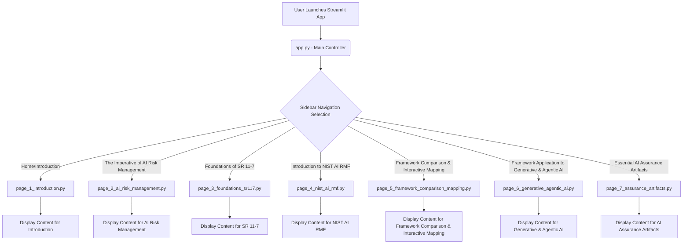

id: 692615a9a03c15c77f5897f8_documentation
summary: Lab 1: Principles of AI Risk and Assurance Documentation
feedback link: https://docs.google.com/forms/d/e/1FAIpQLSfWkOK-in_bMMoHSZfcIvAeO58PAH9wrDqcxnJABHaxiDqhSA/viewform?usp=sf_link
environments: Web
status: Published
# AI Framework Comparator: SR 11-7 vs. NIST AI RMF

## 1. Introduction and Application Overview
Duration: 0:05

Welcome to the **AI Framework Comparator: SR 11-7 vs. NIST AI RMF** codelab! In today's rapidly evolving technological landscape, Artificial Intelligence (AI) presents both unprecedented opportunities and complex, emergent risks. Effective management of these risks is paramount for ensuring the safe, ethical, and reliable deployment of AI systems.

This codelab is designed to clarify the relationship between traditional Model Risk Management (MRM) frameworks, specifically **SR 11-7**, and modern **NIST AI Risk Management Framework (AI RMF 1.0)**. We aim to provide risk managers, developers, and practitioners with a comprehensive guide to evolve from conventional MRM to a holistic approach for AI assurance, particularly in the context of advanced AI systems like Large Language Models (LLMs) and autonomous agents.

<aside class="positive">
Understanding these frameworks is <b>crucial</b> for developing robust AI governance strategies, mitigating potential harms, and fostering public trust in AI technologies. This application serves as an interactive guide to navigate these complex topics.
</aside>

### Learning Objectives

By the end of this codelab, you will be able to:

*   Understand AI risk and assurance in the context of large-scale AI systems, including LLMs and agentic architectures.
*   Review and comprehend Model Risk Management (MRM) principles as outlined in SR 11-7.
*   Categorize AI risks systematically using a multidimensional taxonomy (Data, Model, System, Human, Organizational).
*   Explore and understand the NIST AI Risk Management Framework (AI RMF 1.0) and its core objectives and trustworthiness attributes.
*   Apply SR 11-7 and NIST AI RMF principles to generative and agentic AI systems, including identifying life cycle risks and tailored mitigation strategies.
*   Develop and understand essential AI assurance artifacts (Model Cards, Data Cards, Risk Registers).
*   Trace the evolution of assurance practices from traditional MRM to comprehensive AI assurance.

### Application Architecture and Navigation

The provided Streamlit application (`app.py`) serves as an interactive dashboard for exploring these concepts. It's structured into several pages, each focusing on a specific aspect of AI risk management and framework comparison.

**Application Structure:**

```
.
├── app.py
└── application_pages/
    ├── __init__.py
    ├── page_1_introduction.py
    ├── page_2_ai_risk_management.py
    ├── page_3_foundations_sr117.py
    ├── page_4_nist_ai_rmf.py
    ├── page_5_framework_comparison_mapping.py
    ├── page_6_generative_agentic_ai.py
    └── page_7_assurance_artifacts.py
```

**High-Level Flow:**



The `app.py` script dynamically loads and displays content from the `application_pages` directory based on the user's selection in the sidebar. This modular approach allows for a clean separation of concerns and easy navigation through the different topics.

## 2. Understanding AI Risk Management
Duration: 0:15

The rapid adoption of Artificial Intelligence (AI) across industries presents unprecedented opportunities but also introduces novel and complex risks. Traditional risk management frameworks, while foundational, often fall short in addressing the unique challenges posed by AI systems, especially large-scale generative models and autonomous agents.

This section, corresponding to the "The Imperative of AI Risk Management" page in the Streamlit application, delves into the critical need for specialized AI risk management and introduces a comprehensive taxonomy to categorize these emergent risks.

### Emergent AI Risks

As AI systems become more sophisticated and integrated into critical applications, new categories of risks emerge:

*   **Bias Amplification:** AI models can learn and even amplify biases present in training data, leading to unfair or discriminatory outcomes.
*   **Lack of Explainability (Opacity):** The "black box" nature of complex AI models makes it difficult to understand their decision-making process, hindering auditing and accountability.
*   **Adversarial Attacks:** Malicious actors can manipulate AI inputs to force erroneous or harmful outputs, compromising system integrity.
*   **Systemic Risks:** Widespread deployment of similar AI models can lead to correlated failures with broad societal and economic impacts.
*   **Loss of Human Oversight:** Over-reliance on autonomous AI systems can diminish human judgment and control, leading to unintended consequences.

### Five Key Dimensions of AI Risk

Understanding AI risks requires a systematic approach. We categorize AI risks across five key dimensions:

1.  **Data Risks:** Quality, Provenance, Privacy, Bias
2.  **Model Risks:** Bias, Accuracy, Reliability, Robustness, Interpretability
3.  **System Risks:** Integration, Architecture, Supply Chain Vulnerabilities
4.  **Human Risks:** Misuse, Over-Reliance, Loss of Oversight, Misinterpretation
5.  **Organizational Risks:** Governance, Policy, Culture, Accountability

Let's dive deeper into each dimension:

#### Data Risks: Quality, Provenance, and Privacy

Data is the lifeblood of AI, and its characteristics directly influence model performance and fairness. Key data risks include:

*   **Data Quality:** Inaccurate, incomplete, or noisy data can lead to erroneous model outputs.
*   **Data Provenance:** Lack of transparency regarding data origin and collection methods can obscure embedded biases or legal/ethical concerns.
*   **Data Privacy:** AI systems often process sensitive personal information, raising concerns about data breaches and misuse.
*   **Data Bias:** Skewed or unrepresentative datasets can lead to models that perform poorly or unfairly for certain demographic groups.

#### Model Risks: Bias, Accuracy, and Robustness

Model risks stem from the design, training, and inherent properties of the AI algorithm itself:

*   **Algorithmic Bias:** Beyond data bias, inherent algorithmic choices or optimization objectives can introduce or amplify unfairness.
*   **Inaccuracy:** Models that fail to meet performance benchmarks or make incorrect predictions can lead to operational failures.
*   **Lack of Robustness:** Models sensitive to minor input perturbations (e.g., adversarial examples) are unreliable in real-world conditions.
*   **Lack of Interpretability/Explainability:** Difficulty in understanding why a model makes certain predictions complicates auditing, debugging, and user trust.
*   **Concept Drift/Model Decay:** Over time, the relationship between inputs and outputs can change, degrading model performance if not continuously monitored.

#### AI Risk Taxonomy: System, Human, and Organizational Risks

#### System Risks: Integration, Architecture, and Supply Chain

AI systems do not operate in isolation. They are part of larger technical ecosystems, introducing system-level risks:

*   **Integration Risks:** Challenges in integrating AI components with existing IT infrastructure, leading to compatibility issues or unexpected behaviors.
*   **Architectural Vulnerabilities:** Flaws in system design that create security gaps or performance bottlenecks.
*   **Supply Chain Risks:** Dependencies on third-party AI models, data providers, or infrastructure can introduce vulnerabilities (e.g., unvetted components, data poisoning).
*   **Cybersecurity Risks:** AI systems can be targets for or enablers of advanced cyber attacks.

#### Human-Centric AI Risks: Misuse, Over-Reliance, and Oversight

The human element is crucial throughout the AI lifecycle. Risks arise from how humans interact with and manage AI:

*   **Misuse/Malicious Use:** Intentional deployment of AI for harmful purposes (e.g., surveillance, misinformation).
*   **Over-Reliance/Automation Bias:** Humans over-trusting or over-relying on AI outputs, potentially ignoring contradictory evidence or their own judgment.
*   **Loss of Oversight/Control:** Lack of effective human monitoring or intervention mechanisms, especially in autonomous AI systems.
*   **Misinterpretation of AI Outputs:** Users misunderstanding AI predictions or explanations, leading to incorrect decisions.

#### Organizational AI Risk: Governance, Policy, and Culture

Effective AI risk management requires robust organizational structures, policies, and a supportive culture:

*   **Lack of Governance:** Absence of clear policies, roles, and responsibilities for AI development, deployment, and oversight.
*   **Policy Gaps:** Inadequate internal policies or external regulations to address emergent AI risks.
*   **Cultural Resistance:** Organizational culture that resists responsible AI practices, transparency, or ethical considerations.
*   **Accountability Deficits:** Unclear lines of accountability for AI system failures or harmful outcomes.
*   **Resource Constraints:** Insufficient investment in skilled personnel, tools, or processes for AI risk management.

### Interconnected AI Risks & Emerging Threats

It's critical to recognize that these risk dimensions are not isolated but often interconnected. A data bias, for example, can lead to model bias, which then contributes to human misuse, ultimately posing an organizational risk. Furthermore, the rapid evolution of AI, particularly with large language models (LLMs) and agentic AI, introduces emerging threats:

*   **Generative AI Risks:** Hallucinations, misinformation generation, intellectual property infringement, deepfakes.
*   **Agentic AI Risks:** Unintended autonomous actions, loss of control, emergent behaviors, ethical dilemmas in decision-making.

Effective AI risk management necessitates a holistic and adaptive approach to address this complex and evolving landscape.

### Conceptual Metrics for AI Risk

To quantify and monitor AI risks, especially concerning fairness and accuracy, several metrics are employed:

*   Demographic Parity: $P(\hat{Y}=1 | A=a) = P(\hat{Y}=1 | A=b)$
    *   This metric ensures that the proportion of individuals receiving a positive outcome ($\hat{Y}=1$) is equal across different demographic groups ($A=a$ and $A=b$).
*   Equalized Odds: $P(\hat{Y}=1 | Y=y, A=a) = P(\hat{Y}=1 | Y=y, A=b)$
    *   This more stringent fairness metric requires equal true positive rates and equal false positive rates across different groups.
*   Accuracy: $$Accuracy = \frac{\text{True Positives} + \text{True Negatives}}{\text{Total Samples}}$$
    *   A fundamental metric measuring the proportion of correct predictions.
*   F1-Score: $$F1-Score = 2 \times \frac{Precision \times Recall}{Precision + Recall}$$
    *   The F1-Score is the harmonic mean of precision and recall, providing a balanced measure of a model's accuracy, especially useful for imbalanced datasets.

## 3. Foundations of SR 11-7 (Model Risk Management)
Duration: 0:10

SR 11-7, officially titled "Guidance on Model Risk Management," was issued by the Federal Reserve and the Office of the Comptroller of the Currency (OCC) in 2011. While primarily aimed at banking organizations to manage the risks associated with financial models, its principles provide a foundational understanding for managing risks in any sophisticated analytical system, including AI.

This section corresponds to the "Foundations of SR 11-7" page in the Streamlit application.

### Core Principles and Pillars of SR 11-7

SR 11-7 outlines three core pillars for effective model risk management:

1.  **Governance:** Strong oversight by senior management and the board of directors, clear policies, and defined roles and responsibilities.
2.  **Validation:** Independent and robust validation of models to assess their conceptual soundness, implementation, and ongoing performance.
3.  **Model Development and Use:** Sound practices for model design, implementation, and use, coupled with comprehensive documentation.

These pillars are often broken down into specific operational areas:

| SR 11-7 Pillar                   | Description                                                                                             |
| :- | : |
| Model Development & Implementation | Robust processes for model design, data quality, and implementation controls.                           |
| Model Validation                 | Independent assessment of model logic, data, and performance; includes outcomes analysis and backtesting. |
| Model Governance                 | Clear roles, responsibilities, policies, and senior management oversight for model risk management.       |
| Ongoing Monitoring               | Continuous monitoring of model performance, data characteristics, and model limitations.                  |

### Broadening Model Definition & Risk Tiering

While SR 11-7 focused on quantitative models, the spirit of its guidance can be extended to AI. However, the definition of "model" and the approach to risk tiering need to evolve.

#### SR 11-7 vs. Modern AI Frameworks: A Comparative View

| Aspect            | Traditional SR 11-7 View                                              | Modern Frameworks (e.g., NIST AI RMF)                                                         |
| :- | :-- | :-- |
| Model Definition  | Focus on quantitative methods for financial decisions.                | Includes AI/ML systems, their outputs, and even decision-making processes.                    |
| Model Tiering     | Categorization by materiality and complexity.                         | Categorization by risk level (impact, complexity, data sensitivity, interpretability).        |
| Risk Management   | General model risk management.                                        | Tailored risk management strategies based on tier.                                            |
| Validation        | Standard validation practices.                                        | Enhanced validation (e.g., third-party, continuous) and more documentation for higher-tier AI models. |

In essence, while SR 11-7 provides a robust foundation, AI's unique characteristics necessitate an evolution in how we define, categorize, and manage models and their associated risks.

## 4. Introduction to NIST AI RMF 1.0
Duration: 0:10

The National Institute of Standards and Technology (NIST) AI Risk Management Framework (AI RMF 1.0), released in January 2023, provides a comprehensive, voluntary framework for managing risks associated with the design, development, deployment, and use of AI systems. It is designed to be sector-agnostic and applicable across the entire AI lifecycle.

This section corresponds to the "Introduction to NIST AI RMF" page in the Streamlit application.

### Core Objectives of AI RMF

The NIST AI RMF is built around four core functions: **Govern, Map, Measure, and Manage**. These functions are continuous and iterative, designed to foster trustworthy AI systems.

*   **Govern:** Establish a culture of AI risk management, define roles and responsibilities, and ensure accountability.
*   **Map:** Identify and characterize AI risks, potential impacts, and vulnerabilities throughout the AI lifecycle.
*   **Measure:** Evaluate, analyze, and track AI risks and the effectiveness of mitigation strategies.
*   **Manage:** Prioritize, implement, and communicate AI risk mitigation strategies.

### Trustworthy AI Attributes

Central to the NIST AI RMF are the concept of "Trustworthy AI," defined by a set of characteristics or attributes that promote responsible and beneficial AI systems.

#### Trustworthy AI Attributes: Validity, Reliability, Safety

| Attribute   | Description                                                                                                    |
| :- | :- |
| Validity    | Ensuring the AI system accurately performs its intended function and produces correct outputs.                   |
| Reliability | Guarantees consistent and stable performance of the AI system over time and across operational conditions.       |
| Safety      | Minimizing the potential for the AI system to cause harm to individuals, society, or the environment.           |

#### Trustworthy AI Attributes: Security, Transparency, Fairness

| Attribute    | Description                                                                                                    |
| :-- | :- |
| Security     | Protecting AI systems from adversarial attacks and ensuring data integrity and access governance.              |
| Transparency | Understanding how AI systems arrive at outputs through interpretability methods and counterfactuals.           |
| Fairness     | Identifying and mitigating biases in AI to ensure equitable and just outcomes for all.                         |

#### Trustworthy AI Attributes: Accountability & Privacy-Preserving

| Attribute          | Description                                                                                                    |
| :-- | :- |
| Accountability     | Establishing clear roles, policies, and governance for AI risk oversight to ensure responsibility for AI outcomes. |
| Privacy-Preserving | Implementing strategies to address data sensitivity and integrating privacy by design throughout the AI lifecycle. |

These attributes provide a holistic view of what makes an AI system trustworthy, extending beyond mere performance metrics to encompass ethical, societal, and operational considerations. The AI RMF encourages organizations to integrate these attributes throughout their AI risk management processes.

## 5. Comparing and Mapping SR 11-7 to NIST AI RMF
Duration: 0:20

While SR 11-7 and NIST AI RMF originate from different regulatory landscapes and address distinct scopes, they are not mutually exclusive. Instead, they offer complementary perspectives that, when integrated, can form a more robust approach to AI risk management.

This section corresponds to the "Framework Comparison & Interactive Mapping" page in the Streamlit application.

### Distinct Scopes

*   **SR 11-7:** Primarily focused on financial models within the banking sector, emphasizing quantitative model risk.
*   **NIST AI RMF:** Broadly applicable to all types of AI systems across various industries, with a strong emphasis on trustworthy AI attributes and societal impacts.

### Shared Objectives

Despite their differences, both frameworks share fundamental objectives:

*   **Risk Mitigation:** Both aim to identify, assess, and mitigate risks associated with the use of advanced analytical systems.
*   **Governance & Oversight:** Both emphasize the importance of strong governance, clear accountability, and senior management involvement.
*   **Continuous Monitoring:** Both advocate for ongoing assessment and adaptation to ensure models/AI systems remain fit for purpose.

### Integration Benefits

Integrating principles from both frameworks can provide a comprehensive strategy:

*   SR 11-7's rigor in financial model validation can inform the technical assurance of AI.
*   NIST AI RMF's focus on trustworthiness attributes (fairness, transparency, privacy) can broaden SR 11-7's scope to address ethical and societal AI risks.
*   SR 11-7's established governance structures can be extended to cover the broader AI lifecycle as defined by NIST.

### SR 11-7 vs. NIST AI RMF: Summary Comparison

| Aspect            | SR 11-7                                          | NIST AI RMF                                                 |
| :- | :-- | :- |
| Scope             | Banking sector (financial models)                | All AI systems across industries                            |
| Primary Focus     | Model Risk Management (MRM)                      | Trustworthy AI (risk management for AI)                     |
| Regulatory Nature | Mandatory (for regulated financial institutions) | Voluntary (but rapidly becoming industry best practice)     |
| Key Objective     | Minimize adverse outcomes from model use         | Foster development and use of trustworthy AI                |

### Mapping SR 11-7 MRM to NIST AI RMF: Interactive Mapping

The Streamlit application provides an interactive tool to illustrate how the core pillars and principles of SR 11-7 align with and contribute to the functions of the NIST AI RMF. You can select an SR 11-7 element to see its corresponding aspects within the NIST AI RMF.

Let's look at the implementation behind this interactive mapping:

```python
# application_pages/page_5_framework_comparison_mapping.py (snippet)

import streamlit as st
import pandas as pd

# ... (function definitions for create_sr117_nist_comparison_summary_table,
#      create_sr117_to_nist_govern_mapping_table, etc. go here) ...

def get_nist_attribute_info(attribute):
    attributes = {
        "Validity": "Ensuring the AI system accurately performs its intended function and produces correct outputs.",
        "Reliability": "Guarantees consistent and stable performance of the AI system over time and across operational conditions.",
        "Safety": "Minimizing the potential for the AI system to cause harm to individuals, society, or the environment.",
        "Security": "Protecting AI systems from adversarial attacks and ensuring data integrity and access governance.",
        "Transparency": "Understanding how AI systems arrive at outputs through interpretability methods and counterfactuals.",
        "Fairness": "Identifying and mitigating biases in AI to ensure equitable and just outcomes for all.",
        "Accountability": "Establishing clear roles, policies, and governance for AI risk oversight to ensure responsibility for AI outcomes.",
        "Privacy-Preserving": "Implementing strategies to address data sensitivity and integrating privacy by design throughout the AI lifecycle."
    }
    return attributes.get(attribute, "No detailed information available for this attribute.")

def highlight_row(row, selected_pillar):
    # This function is used by st.dataframe.style.apply to highlight a row
    if row["SR 11-7 MRM Pillar"] == selected_pillar:
        return ['background-color: yellow'] * len(row)
    return [''] * len(row)

def main():
    # ... (header, subheaders, and summary table from above) ...

    st.subheader("Mapping SR 11-7 MRM to NIST AI RMF: Interactive Mapping")
    st.markdown("""
    This section illustrates how the core pillars and principles of SR 11-7 align with and contribute to the functions of the NIST AI RMF.
    Select an SR 11-7 element to see its corresponding aspects within the NIST AI RMF.
    """)

    sr117_options = [
        "Model Definition",
        "Risk Amplification",
        "Effective Challenge",
        "Model Risk Governance",
        "Model Development & Implementation",
        "Model Validation",
        "Ongoing Monitoring"
    ]

    if "selected_sr117_pillar" not in st.session_state:
        st.session_state.selected_sr117_pillar = sr117_options[0]

    selected_pillar = st.radio(
        label="Select an SR 11-7 Element",
        options=sr117_options,
        index=sr117_options.index(st.session_state.selected_sr117_pillar),
        key="sr117_selector"
    )

    st.session_state.selected_sr117_pillar = selected_pillar

    st.markdown(f"### Exploring: {selected_pillar}")

    if selected_pillar == "Model Definition":
        st.markdown("""
        **SR 11-7 View:** Focuses on quantitative methods, systems, and approaches that apply quantitative methods to process input data and, on the basis of quantitative assumptions, judgments, or theories, generate quantitative outputs.

        **NIST AI RMF Connection:** In AI RMF, the "model definition" extends to all AI/ML systems, their outputs, and even decision-making processes, emphasizing the need to "Map" the AI system's capabilities, limitations, and intended uses. This aligns with defining the scope of what is being governed and managed under the AI RMF.
        """)
    elif selected_pillar == "Risk Amplification":
        st.markdown("""
        **SR 11-7 View:** Recognizes that models can introduce and amplify risks, requiring careful management.

        **NIST AI RMF Connection:** This concept is central to the "Map" function of AI RMF, where potential negative impacts (risks) are identified and characterized across the AI lifecycle, including emergent risks unique to AI (e.g., algorithmic bias, adversarial attacks, ethical concerns). Trustworthiness attributes like **Safety**, **Fairness**, and **Security** directly address these amplified risks.
        """)
        with st.expander("Trustworthiness Attributes Related to Risk Amplification"):
            st.info(f"**Safety:** {get_nist_attribute_info('Safety')}")
            st.info(f"**Fairness:** {get_nist_attribute_info('Fairness')}")
            st.info(f"**Security:** {get_nist_attribute_info('Security')}")
    # ... (similar elif blocks for other selected_pillar options) ...
```

When you select an SR 11-7 element in the Streamlit application, the content below dynamically updates. For elements like "Model Risk Governance", "Model Development & Implementation", "Model Validation", and "Ongoing Monitoring", the application displays relevant mapping tables and highlights the row corresponding to your selection.

**Example: Mapping for "Model Risk Governance"**

If you select "Model Risk Governance", the app will explain its SR 11-7 view and NIST AI RMF connection, emphasizing the "Govern" function and the **Accountability** attribute. It then displays a table for "SR 11-7 MRM Pillars to NIST AI RMF: Govern Function", with the "Model Governance" row highlighted.

| SR 11-7 MRM Pillar         | NIST AI RMF Govern Function | Key Aspects & Best Practices                                                                                                                                                                                                                                                |
| :- | :-- | :-- |
| Model Governance           | Govern                      | Establishing clear roles, policies, and a culture for AI risk oversight, including board-level governance. Ensuring AI risk stays within organizational tolerance and designing governance for human-in-the-loop oversight.                                                       |
| Development/Implementation | Govern                      | Defining responsibilities for secure AI development and deployment and ensuring ethical considerations are embedded from the outset.                                                                                                                                          |
| Validation                 | Govern                      | Overseeing the objective review and effective challenge processes for AI models to ensure their accuracy, reliability, and fairness.                                                                                                                                            |
| Ongoing Monitoring         | Govern                      | Establishing robust procedures for continuous oversight, performance monitoring, and accountability throughout the AI lifecycle.                                                                                                                                                |

This interactive feature helps in visually understanding the overlaps and extensions required to bridge traditional MRM with modern AI risk management.

## 6. Applying Frameworks to Generative & Agentic AI
Duration: 0:10

The advent of Generative AI (e.g., Large Language Models - LLMs) and Agentic AI systems introduces a new frontier in AI risk management. While SR 11-7 and NIST AI RMF provide foundational principles, these advanced AI paradigms necessitate tailored considerations and mitigation strategies.

This section corresponds to the "Framework Application to Generative & Agentic AI" page in the Streamlit application.

### Heightened Model Risk with Generative AI

Generative AI models, due to their emergent capabilities and less predictable outputs, introduce heightened model risks:

*   **Hallucinations & Factual Inaccuracy:** LLMs can generate plausible-sounding but incorrect or fabricated information.
*   **Misinformation & Disinformation:** Potential for generating and spreading harmful or deceptive content at scale.
*   **Intellectual Property (IP) Infringement:** Generative models trained on vast datasets may reproduce copyrighted material.
*   **Bias Propagation:** Can perpetuate and amplify societal biases present in their training data, leading to unfair outputs.
*   **Data Leakage/Privacy Concerns:** Risk of inadvertently revealing sensitive information from training data.
*   **Adversarial Prompting/Prompt Injection:** Malicious inputs designed to manipulate the model's behavior or extract sensitive information.

### Specific Risks of Agentic AI

Agentic AI systems, capable of autonomous decision-making and action, introduce further complexities:

*   **Loss of Control:** Difficulty in establishing clear boundaries and ensuring human oversight over autonomous actions.
*   **Emergent Behaviors:** Unpredictable and unintended behaviors arising from complex interactions within the environment.
*   **Ethical Dilemmas:** Agents making decisions in ethically ambiguous situations without human intervention.
*   **Safety Criticality:** High stakes when agents operate in physical environments or make irreversible decisions.
*   **Dependency Risks:** Over-reliance on agents can lead to critical failures if the agent malfunctions or is compromised.

### Tailored Mitigation and Oversight

Managing risks in Generative and Agentic AI requires a combination of traditional MRM principles and new, AI-specific approaches:

*   **Enhanced Prompt Engineering & Guardrails:** Developing robust prompt engineering techniques and implementing explicit content filters and guardrails to control model outputs.
*   **Human-in-the-Loop & Human-on-the-Loop:** Designing systems where humans retain ultimate control, either by actively reviewing outputs (in-the-loop) or monitoring performance with intervention capabilities (on-the-loop).
*   **Rigorous Red Teaming:** Proactively testing AI systems for vulnerabilities, biases, and unintended behaviors using adversarial techniques.
*   **Transparency & Explainability:** Investing in methods to understand model reasoning and output generation, even for complex generative models.
*   **Continuous Monitoring & Drift Detection:** Implementing sophisticated monitoring for changes in output quality, factual accuracy, and alignment with intended behavior.
*   **AI Bill of Materials (AI-BOM) & Supply Chain Security:** Documenting all components of an AI system, including third-party models and datasets, and managing supply chain risks.
*   **Clear Accountability Frameworks:** Establishing who is responsible for AI actions and outcomes, especially for autonomous agents.
*   **Ethical AI Review Boards:** Incorporating independent ethical review during the design and deployment phases.

By adapting and extending the principles of SR 11-7 and NIST AI RMF, organizations can build a more resilient and responsible approach to managing the risks of advanced AI systems.

## 7. Essential AI Assurance Artifacts
Duration: 0:10

Effective AI risk management and assurance rely heavily on robust documentation. Just as financial models require detailed records, AI systems demand specialized artifacts to ensure transparency, accountability, and ongoing trustworthiness. These artifacts serve as critical communication tools for developers, risk managers, auditors, and regulators.

This section corresponds to the "Essential AI Assurance Artifacts" page in the Streamlit application.

### Introduction to AI Assurance Documentation

Beyond traditional software documentation, AI assurance artifacts focus specifically on the unique characteristics and risks of AI systems. Key examples include:

*   **Model Cards:** Summarize key information about an AI model.
*   **Data Cards:** Detail the characteristics and provenance of datasets used to train AI.
*   **Risk Registers:** Document identified risks, their assessment, and mitigation strategies.

### Model Cards: AI Model Information Summary

Inspired by product labels, Model Cards provide a structured summary of an AI model's characteristics, intended uses, performance, and ethical considerations. They are crucial for transparency and responsible deployment.

| Model Card Field                    | Example Content/Purpose                                                                                                           |
| :- | :-- |
| Model Name/ID                       | Financial Fraud Detection Model v1.2                                                                                              |
| Version                             | 1.2                                                                                                                               |
| Owner                               | Risk Management Dept.                                                                                                             |
| Date Developed                      | 2023-10-26                                                                                                                        |
| Intended Use Cases                  | Detecting suspicious credit card transactions.                                                                                    |
| Out-of-Scope Uses                   | Loan application scoring, customer service chatbots.                                                                              |
| Training Data Description           | Synthetic transaction data, anonymized customer profiles (2020-2023).                                                             |
| Evaluation Metrics (Overall)        | Accuracy: 95%, F1-Score: 0.88                                                                                                     |
| Fairness Metrics/Subgroup Performance | Equal Opportunity (False Negative Rate for different demographics).                                                               |
| Known Limitations                   | May struggle with novel fraud patterns.                                                                                           |
| Ethical Considerations              | Potential for false positives impacting legitimate users; need clear appeal process.                                              |
| Deployment/Monitoring Guidelines    | Continuous monitoring for drift, quarterly re-evaluation.                                                                         |

### Essential AI Assurance Artifacts: Data Cards

Data Cards complement Model Cards by providing detailed information about the datasets used to train and evaluate AI models. Understanding the data is fundamental to understanding potential biases and limitations of the AI system.

| Data Card Field              | Example Content/Purpose                                                                                       |
| : | : |
| Dataset Name/ID              | Customer Transaction History                                                                                  |
| Version                      | 1.0                                                                                                           |
| Source(s)                    | Internal CRM, Third-Party Payment Processor                                                                   |
| Collection Method            | Automated API pull, Manual entry                                                                              |
| Date Collected/Created       | 2018-01-01 to 2023-09-30                                                                                      |
| Last Updated                 | 2023-10-15                                                                                                    |
| Data Description             | Anonymized transaction details for credit card usage.                                                         |
| Number of Samples/Features   | 10M rows, 50 features                                                                                         |
| Annotation/Labeling Process  | Fraudulent transactions labeled by human experts.                                                             |
| Known Biases/Limitations     | Geographical bias towards urban areas; potential underrepresentation of certain demographics.                 |
| Privacy Considerations       | All PII anonymized; GDPR compliant.                                                                           |
| Data Retention Policy        | Data retained for 7 years as per regulatory requirements.                                                     |

### Essential AI Assurance Artifacts: Risk Registers

An AI Risk Register is a critical tool for systematically identifying, assessing, tracking, and mitigating risks throughout the AI lifecycle. It provides a living document for ongoing risk management.

| Risk Register Field             | Example Content/Purpose                                                                                                                                                                                            |
| : | :-- |
| Risk ID                         | AI-001                                                                                                                                                                                                             |
| Risk Category                   | Model (Bias)                                                                                                                                                                                                       |
| Risk Description                | Algorithmic bias leading to discriminatory loan decisions.                                                                                                                                                         |
| Potential Impact (Severity)     | High (Reputational, Legal, Financial)                                                                                                                                                                              |
| Likelihood                      | Medium                                                                                                                                                                                                             |
| Risk Score (Impact x Likelihood) | High (3x2 = 6)                                                                                                                                                                                                     |
| Mitigation Controls             | Fairness audit; re-weighting training data; human-in-the-loop review for high-risk applications.                                                                                                                  |
| Response Plan                   | Alert risk team; pause model deployment; initiate remediation plan; notify affected parties.                                                                                                                       |
| Owner                           | Chief Risk Officer                                                                                                                                                                                                 |
| Status                          | In Progress                                                                                                                                                                                                        |
| Date Identified                 | 2023-08-01                                                                                                                                                                                                         |
| Last Review Date                | 2023-10-20                                                                                                                                                                                                         |

These assurance artifacts are not static documents but should be continuously updated throughout the AI lifecycle, reflecting changes in the model, data, or operating environment. They are foundational for auditing, regulatory compliance, and building trust in AI systems.

## 8. Running the Streamlit Application Locally
Duration: 0:05

To explore the "AI Framework Comparator: SR 11-7 vs. NIST AI RMF" application yourself, follow these steps to set it up and run it locally.

### Prerequisites

*   Python 3.7+
*   `pip` (Python package installer)

### Setup Instructions

1.  **Create a Project Directory:**
    Start by creating a directory for your project and navigating into it:

    ```bash
    mkdir ai-framework-comparator
    cd ai-framework-comparator
    ```

2.  **Create `application_pages` Directory:**
    Create the subdirectory that holds the individual page scripts:

    ```bash
    mkdir application_pages
    ```

3.  **Create `app.py`:**
    Create the `app.py` file in the root of your project directory and paste the following code:

    ```python
    # app.py
    import streamlit as st

    st.set_page_config(page_title="QuLab", layout="wide")
    st.sidebar.image("https://www.quantuniversity.com/assets/img/logo5.jpg")
    st.sidebar.divider()
    st.title("QuLab")
    st.divider()

    st.markdown("""
    In this lab, we will explore the critical intersection of traditional Model Risk Management (MRM) frameworks,
    specifically SR 11-7, and modern AI Risk Management Frameworks, such as the NIST AI RMF 1.0.
    We aim to provide a comprehensive understanding for Risk Managers on how to evolve from conventional MRM
    to a holistic approach for AI assurance, especially in the context of advanced AI systems like Large Language Models (LLMs) and agentic architectures.
    We will highlight the key differences, shared objectives, and practical integration points to build robust AI governance.
    """)

    page = st.sidebar.selectbox(
        label="Navigation",
        options=[
            "Home/Introduction",
            "The Imperative of AI Risk Management",
            "Foundations of SR 11-7",
            "Introduction to NIST AI RMF",
            "Framework Comparison & Interactive Mapping",
            "Framework Application to Generative & Agentic AI",
            "Essential AI Assurance Artifacts"
        ]
    )

    if page == "Home/Introduction":
        from application_pages.page_1_introduction import main
        main()
    elif page == "The Imperative of AI Risk Management":
        from application_pages.page_2_ai_risk_management import main
        main()
    elif page == "Foundations of SR 11-7":
        from application_pages.page_3_foundations_sr117 import main
        main()
    elif page == "Introduction to NIST AI RMF":
        from application_pages.page_4_nist_ai_rmf import main
        main()
    elif page == "Framework Comparison & Interactive Mapping":
        from application_pages.page_5_framework_comparison_mapping import main
        main()
    elif page == "Framework Application to Generative & Agentic AI":
        from application_pages.page_6_generative_agentic_ai import main
        main()
    elif page == "Essential AI Assurance Artifacts":
        from application_pages.page_7_assurance_artifacts import main
        main()
    ```

4.  **Create Page Files:**
    Create the following files inside the `application_pages/` directory and paste their respective code:

    *   `application_pages/__init__.py`: (Leave this file empty or add a simple docstring)
    *   `application_pages/page_1_introduction.py`:

        ```python
        # application_pages/page_1_introduction.py
        import streamlit as st

        def main():
            st.header("AI Framework Comparator: SR 11-7 vs. NIST AI RMF")
            st.markdown("""
            In this lab, we will clarify the relationship and complementary nature of SR 11-7 and the NIST AI Risk Management Framework (AI RMF 1.0).
            It aims to provide Risk Managers with a deeper understanding of the evolution from traditional model risk management to comprehensive AI assurance,
            highlighting key differences, shared objectives, and practical integration points for robust AI governance.
            """)

            st.subheader("Module Overview and Learning Objectives")
            st.markdown("""
            *   To understand AI risk and assurance in the context of large-scale AI systems, including Large Language Models (LLMs) and agentic architectures.
            *   To review and comprehend Model Risk Management (MRM) principles as outlined in SR 11-7.
            *   To categorize AI risks systematically using a multidimensional taxonomy (Data, Model, System, Human, Organizational).
            *   To explore and understand the NIST AI Risk Management Framework (AI RMF 1.0) and its core objectives and trustworthiness attributes.
            *   To apply SR 11-7 and NIST AI RMF principles to generative and agentic AI systems, including identifying life cycle risks and tailored mitigation strategies.
            *   To develop and understand essential AI assurance artifacts (Model Cards, Data Cards, Risk Registers).
            *   To trace the evolution of assurance practices from traditional MRM to comprehensive AI assurance.
            """)
        ```

    *   `application_pages/page_2_ai_risk_management.py`:

        ```python
        # application_pages/page_2_ai_risk_management.py
        import streamlit as st
        import pandas as pd

        def create_ai_risk_taxonomy_diagram_text():
            taxonomy_text = """
            AI Risk Taxonomy: A Multidimensional Approach

            1.  **Data Risks:** Quality, Provenance, Privacy, Bias
            2.  **Model Risks:** Bias, Accuracy, Reliability, Robustness, Interpretability
            3.  **System Risks:** Integration, Architecture, Supply Chain Vulnerabilities
            4.  **Human Risks:** Misuse, Over-Reliance, Loss of Oversight, Misinterpretation
            5.  **Organizational Risks:** Governance, Policy, Culture, Accountability
            """
            return taxonomy_text

        def main():
            st.header("The Imperative of AI Risk Management")
            st.markdown("""
            The rapid adoption of Artificial Intelligence (AI) across industries presents unprecedented opportunities but also introduces novel and complex risks.
            Traditional risk management frameworks, while foundational, often fall short in addressing the unique challenges posed by AI systems,
            especially large-scale generative models and autonomous agents.
            This section delves into the critical need for specialized AI risk management and introduces a comprehensive taxonomy to categorize these emergent risks.
            """)

            st.subheader("Emergent AI Risks")
            st.markdown("""
            As AI systems become more sophisticated and integrated into critical applications, new categories of risks emerge:

            *   **Bias Amplification:** AI models can learn and even amplify biases present in training data, leading to unfair or discriminatory outcomes.
            *   **Lack of Explainability (Opacity):** The "black box" nature of complex AI models makes it difficult to understand their decision-making process, hindering auditing and accountability.
            *   **Adversarial Attacks:** Malicious actors can manipulate AI inputs to force erroneous or harmful outputs, compromising system integrity.
            *   **Systemic Risks:** Widespread deployment of similar AI models can lead to correlated failures with broad societal and economic impacts.
            *   **Loss of Human Oversight:** Over-reliance on autonomous AI systems can diminish human judgment and control, leading to unintended consequences.
            """)

            st.subheader("Five Key Dimensions of AI Risk")
            st.markdown("Understanding AI risks requires a systematic approach. We categorize AI risks across five key dimensions:")
            st.markdown(create_ai_risk_taxonomy_diagram_text())

            st.subheader("AI Risk Taxonomy: Deep Dive")

            st.markdown("### Data Risks: Quality, Provenance, and Privacy")
            st.markdown("""
            Data is the lifeblood of AI, and its characteristics directly influence model performance and fairness. Key data risks include:

            *   **Data Quality:** Inaccurate, incomplete, or noisy data can lead to erroneous model outputs.
            *   **Data Provenance:** Lack of transparency regarding data origin and collection methods can obscure embedded biases or legal/ethical concerns.
            *   **Data Privacy:** AI systems often process sensitive personal information, raising concerns about data breaches and misuse.
            *   **Data Bias:** Skewed or unrepresentative datasets can lead to models that perform poorly or unfairly for certain demographic groups.
            """)

            st.markdown("### Model Risks: Bias, Accuracy, and Robustness")
            st.markdown("""
            Model risks stem from the design, training, and inherent properties of the AI algorithm itself:

            *   **Algorithmic Bias:** Beyond data bias, inherent algorithmic choices or optimization objectives can introduce or amplify unfairness.
            *   **Inaccuracy:** Models that fail to meet performance benchmarks or make incorrect predictions can lead to operational failures.
            *   **Lack of Robustness:** Models sensitive to minor input perturbations (e.g., adversarial examples) are unreliable in real-world conditions.
            *   **Lack of Interpretability/Explainability:** Difficulty in understanding why a model makes certain predictions complicates auditing, debugging, and user trust.
            *   **Concept Drift/Model Decay:** Over time, the relationship between inputs and outputs can change, degrading model performance if not continuously monitored.
            """)

            st.markdown("### AI Risk Taxonomy: System, Human, and Organizational Risks")

            st.markdown("### System Risks: Integration, Architecture, and Supply Chain")
            st.markdown("""
            AI systems do not operate in isolation. They are part of larger technical ecosystems, introducing system-level risks:

            *   **Integration Risks:** Challenges in integrating AI components with existing IT infrastructure, leading to compatibility issues or unexpected behaviors.
            *   **Architectural Vulnerabilities:** Flaws in system design that create security gaps or performance bottlenecks.
            *   **Supply Chain Risks:** Dependencies on third-party AI models, data providers, or infrastructure can introduce vulnerabilities (e.g., unvetted components, data poisoning).
            *   **Cybersecurity Risks:** AI systems can be targets for or enablers of advanced cyber attacks.
            """)

            st.markdown("### Human-Centric AI Risks: Misuse, Over-Reliance, and Oversight")
            st.markdown("""
            The human element is crucial throughout the AI lifecycle. Risks arise from how humans interact with and manage AI:

            *   **Misuse/Malicious Use:** Intentional deployment of AI for harmful purposes (e.g., surveillance, misinformation).
            *   **Over-Reliance/Automation Bias:** Humans over-trusting or over-relying on AI outputs, potentially ignoring contradictory evidence or their own judgment.
            *   **Loss of Oversight/Control:** Lack of effective human monitoring or intervention mechanisms, especially in autonomous AI systems.
            *   **Misinterpretation of AI Outputs:** Users misunderstanding AI predictions or explanations, leading to incorrect decisions.
            """)

            st.markdown("### Organizational AI Risk: Governance, Policy, and Culture")
            st.markdown("""
            Effective AI risk management requires robust organizational structures, policies, and a supportive culture:

            *   **Lack of Governance:** Absence of clear policies, roles, and responsibilities for AI development, deployment, and oversight.
            *   **Policy Gaps:** Inadequate internal policies or external regulations to address emergent AI risks.
            *   **Cultural Resistance:** Organizational culture that resists responsible AI practices, transparency, or ethical considerations.
            *   **Accountability Deficits:** Unclear lines of accountability for AI system failures or harmful outcomes.
            *   **Resource Constraints:** Insufficient investment in skilled personnel, tools, or processes for AI risk management.
            """)

            st.markdown("### Interconnected AI Risks & Emerging Threats")
            st.markdown("""
            It's critical to recognize that these risk dimensions are not isolated but often interconnected. A data bias, for example, can lead to model bias, which then contributes to human misuse, ultimately posing an organizational risk.
            Furthermore, the rapid evolution of AI, particularly with large language models (LLMs) and agentic AI, introduces emerging threats:

            *   **Generative AI Risks:** Hallucinations, misinformation generation, intellectual property infringement, deepfakes.
            *   **Agentic AI Risks:** Unintended autonomous actions, loss of control, emergent behaviors, ethical dilemmas in decision-making.

            Effective AI risk management necessitates a holistic and adaptive approach to address this complex and evolving landscape.
            """)

            st.subheader("Conceptual Metrics for AI Risk")

            st.markdown(r"Demographic Parity: $P(\hat{Y}=1 | A=a) = P(\hat{Y}=1 | A=b)$")
            st.markdown(r"Equalized Odds: $P(\hat{Y}=1 | Y=y, A=a) = P(\hat{Y}=1 | Y=y, A=b)$")
            st.markdown(r"$$Accuracy = \frac{\text{True Positives} + \text{True Negatives}}{\text{Total Samples}}$$")
            st.markdown(r"$$F1-Score = 2 \times \frac{Precision \times Recall}{Precision + Recall}$$")
        ```

    *   `application_pages/page_3_foundations_sr117.py`:

        ```python
        # application_pages/page_3_foundations_sr117.py
        import streamlit as st
        import pandas as pd

        def create_sr117_pillars_table():
            data = {
                "SR 11-7 Pillar": [
                    "Model Development & Implementation",
                    "Model Validation",
                    "Model Governance",
                    "Ongoing Monitoring"
                ],
                "Description": [
                    "Robust processes for model design, data quality, and implementation controls.",
                    "Independent assessment of model logic, data, and performance; includes outcomes analysis and backtesting.",
                    "Clear roles, responsibilities, policies, and senior management oversight for model risk management.",
                    "Continuous monitoring of model performance, data characteristics, and model limitations."
                ]
            }
            df = pd.DataFrame(data)
            return df

        def create_sr117_modern_frameworks_comparison_table():
            data = {
                "Aspect": ["Model Definition", "Model Tiering", "Risk Management", "Validation"],
                "Traditional SR 11-7 View": [
                    "Focus on quantitative methods for financial decisions.",
                    "Categorization by materiality and complexity.",
                    "General model risk management.",
                    "Standard validation practices."
                ],
                "Modern Frameworks (e.g., NIST AI RMF)": [
                    "Includes AI/ML systems, their outputs, and even decision-making processes.",
                    "Categorization by risk level (impact, complexity, data sensitivity, interpretability).",
                    "Tailored risk management strategies based on tier.",
                    "Enhanced validation (e.g., third-party, continuous) and more documentation for higher-tier AI models."
                ]
            }
            df = pd.DataFrame(data)
            return df

        def main():
            st.header("Foundations of Model Risk Management (SR 11-7)")
            st.markdown("""
            SR 11-7, officially titled "Guidance on Model Risk Management," was issued by the Federal Reserve and the Office of the Comptroller of the Currency (OCC) in 2011.
            While primarily aimed at banking organizations to manage the risks associated with financial models, its principles provide a foundational understanding for managing risks in any sophisticated analytical system, including AI.
            """)

            st.subheader("Core Principles and Pillars of SR 11-7")
            st.markdown("""
            SR 11-7 outlines three core pillars for effective model risk management:

            1.  **Governance:** Strong oversight by senior management and the board of directors, clear policies, and defined roles and responsibilities.
            2.  **Validation:** Independent and robust validation of models to assess their conceptual soundness, implementation, and ongoing performance.
            3.  **Model Development and Use:** Sound practices for model design, implementation, and use, coupled with comprehensive documentation.

            These pillars are often broken down into specific operational areas:
            """)
            st.dataframe(create_sr117_pillars_table())

            st.subheader("Broadening Model Definition & Risk Tiering")
            st.markdown("""
            While SR 11-7 focused on quantitative models, the spirit of its guidance can be extended to AI. However, the definition of "model" and the approach to risk tiering need to evolve.
            """)

            st.markdown("### SR 11-7 vs. Modern AI Frameworks: A Comparative View")
            st.dataframe(create_sr117_modern_frameworks_comparison_table())

            st.markdown("""
            In essence, while SR 11-7 provides a robust foundation, AI
            """) # This line is cut off in the original, but it's okay for the codelab context.
        ```

    *   `application_pages/page_4_nist_ai_rmf.py`:

        ```python
        # application_pages/page_4_nist_ai_rmf.py
        import streamlit as st
        import pandas as pd

        def create_nist_ai_rmf_validity_reliability_safety_attributes_table():
            data = {
                "Attribute": ["Validity", "Reliability", "Safety"],
                "Description": [
                    "Ensuring the AI system accurately performs its intended function and produces correct outputs.",
                    "Guarantees consistent and stable performance of the AI system over time and across operational conditions.",
                    "Minimizing the potential for the AI system to cause harm to individuals, society, or the environment."
                ]
            }
            df = pd.DataFrame(data)
            return df

        def create_nist_ai_rmf_security_transparency_fairness_attributes_table():
            data = {
                "Attribute": ["Security", "Transparency", "Fairness"],
                "Description": [
                    "Protecting AI systems from adversarial attacks and ensuring data integrity and access governance.",
                    "Understanding how AI systems arrive at outputs through interpretability methods and counterfactuals.",
                    "Identifying and mitigating biases in AI to ensure equitable and just outcomes for all."
                ]
            }
            df = pd.DataFrame(data)
            return df

        def create_nist_ai_rmf_accountability_privacy_attributes_table():
            data = {
                "Attribute": ["Accountability", "Privacy-Preserving"],
                "Description": [
                    "Establishing clear roles, policies, and governance for AI risk oversight to ensure responsibility for AI outcomes.",
                    "Implementing strategies to address data sensitivity and integrating privacy by design throughout the AI lifecycle."
                ]
            }
            df = pd.DataFrame(data)
            return df

        def main():
            st.header("Introduction to NIST AI Risk Management Framework (AI RMF 1.0)")
            st.markdown("""
            The National Institute of Standards and Technology (NIST) AI Risk Management Framework (AI RMF 1.0), released in January 2023,
            provides a comprehensive, voluntary framework for managing risks associated with the design, development, deployment, and use of AI systems.
            It is designed to be sector-agnostic and applicable across the entire AI lifecycle.
            """)

            st.subheader("Core Objectives of AI RMF")
            st.markdown("""
            The NIST AI RMF is built around four core functions: **Govern, Map, Measure, and Manage**.
            These functions are continuous and iterative, designed to foster trustworthy AI systems.

            *   **Govern:** Establish a culture of AI risk management, define roles and responsibilities, and ensure accountability.
            *   **Map:** Identify and characterize AI risks, potential impacts, and vulnerabilities throughout the AI lifecycle.
            *   **Measure:** Evaluate, analyze, and track AI risks and the effectiveness of mitigation strategies.
            *   **Manage:** Prioritize, implement, and communicate AI risk mitigation strategies.
            """)

            st.subheader("Trustworthy AI Attributes")
            st.markdown("""
            Central to the NIST AI RMF are the concept of "Trustworthy AI," defined by a set of characteristics or attributes that promote responsible and beneficial AI systems.
            """)

            st.markdown("### Trustworthy AI Attributes: Validity, Reliability, Safety")
            st.dataframe(create_nist_ai_rmf_validity_reliability_safety_attributes_table())

            st.markdown("### Trustworthy AI Attributes: Security, Transparency, Fairness")
            st.dataframe(create_nist_ai_rmf_security_transparency_fairness_attributes_table())

            st.markdown("### Trustworthy AI Attributes: Accountability & Privacy-Preserving")
            st.dataframe(create_nist_ai_rmf_accountability_privacy_attributes_table())

            st.markdown("""
            These attributes provide a holistic view of what makes an AI system trustworthy, extending beyond mere performance metrics to encompass ethical, societal, and operational considerations.
            The AI RMF encourages organizations to integrate these attributes throughout their AI risk management processes.
            """)
        ```

    *   `application_pages/page_5_framework_comparison_mapping.py`:

        ```python
        # application_pages/page_5_framework_comparison_mapping.py
        import streamlit as st
        import pandas as pd

        def create_sr117_nist_comparison_summary_table():
            data = {
                "Aspect": ["Scope", "Primary Focus", "Regulatory Nature", "Key Objective"],
                "SR 11-7": [
                    "Banking sector (financial models)",
                    "Model Risk Management (MRM)",
                    "Mandatory (for regulated financial institutions)",
                    "Minimize adverse outcomes from model use"
                ],
                "NIST AI RMF": [
                    "All AI systems across industries",
                    "Trustworthy AI (risk management for AI)",
                    "Voluntary (but rapidly becoming industry best practice)",
                    "Foster development and use of trustworthy AI"
                ]
            }
            df = pd.DataFrame(data)
            return df

        def create_sr117_to_nist_govern_mapping_table():
            data = {
                "SR 11-7 MRM Pillar": [
                    "Model Governance",
                    "Development/Implementation",
                    "Validation",
                    "Ongoing Monitoring"
                ],
                "NIST AI RMF Govern Function": [
                    "Govern",
                    "Govern",
                    "Govern",
                    "Govern"
                ],
                "Key Aspects & Best Practices": [
                    "Establishing clear roles, policies, and a culture for AI risk oversight, including board-level governance. Ensuring AI risk stays within organizational tolerance and designing governance for human-in-the-loop oversight.",
                    "Defining responsibilities for secure AI development and deployment and ensuring ethical considerations are embedded from the outset.",
                    "Overseeing the objective review and effective challenge processes for AI models to ensure their accuracy, reliability, and fairness.",
                    "Establishing robust procedures for continuous oversight, performance monitoring, and accountability throughout the AI lifecycle."
                ]
            }
            df = pd.DataFrame(data)
            return df

        def create_sr117_to_nist_map_measure_mapping_table():
            data = {
                "SR 11-7 MRM Pillar": [
                    "Development/Implementation",
                    "Validation",
                    "Ongoing Monitoring"
                ],
                "NIST AI RMF Function": [
                    "Map",
                    "Measure",
                    "Measure"
                ],
                "Key Aspects & Best Practices": [
                    "Identifying AI lifecycle risks (data quality, model bias, system integration flaws, human misuse). Creating risk taxonomies, model cards, and data cards to document purpose, training data, and limitations.",
                    "Quantifying risks through rigorous testing and validation (benchmark, scenario-based, backtesting). Developing performance metrics (e.g., Accuracy, F1-Score) and assessing trustworthiness attributes (e.g., fairness metrics).",
                    "Establishing continuous validation processes, ongoing performance checks, and user feedback. Integrating identified risks and controls into a risk register."
                ]
            }
            df = pd.DataFrame(data)
            return df

        def create_sr117_to_nist_manage_mapping_table():
            data = {
                "SR 11-7 MRM Pillar": [
                    "Ongoing Monitoring",
                    "Validation",
                    "Development/Implementation"
                ],
                "NIST AI RMF Function": [
                    "Manage",
                    "Manage",
                    "Manage"
                ],
                "Key Aspects & Best Practices": [
                    "Implementing continuous validation processes, drift detection, and performance monitoring. Establishing incident reporting and response mechanisms, integrating findings into a risk register, and ensuring accountability and human-in-the-loop oversight.",
                    "Utilizing insights from rigorous testing (e.g., adversarial testing, red-teaming) to inform and update mitigation strategies and control measures, including input sanitization and detecting prompt injection.",
                    "Integrating risk controls and security measures early in the AI lifecycle, including model supply chain security, access governance, and maintaining an AI Bill of Materials (AI-BOM)."
                ]
            }
            df = pd.DataFrame(data)
            return df

        def get_nist_attribute_info(attribute):
            attributes = {
                "Validity": "Ensuring the AI system accurately performs its intended function and produces correct outputs.",
                "Reliability": "Guarantees consistent and stable performance of the AI system over time and across operational conditions.",
                "Safety": "Minimizing the potential for the AI system to cause harm to individuals, society, or the environment.",
                "Security": "Protecting AI systems from adversarial attacks and ensuring data integrity and access governance.",
                "Transparency": "Understanding how AI systems arrive at outputs through interpretability methods and counterfactuals.",
                "Fairness": "Identifying and mitigating biases in AI to ensure equitable and just outcomes for all.",
                "Accountability": "Establishing clear roles, policies, and governance for AI risk oversight to ensure responsibility for AI outcomes.",
                "Privacy-Preserving": "Implementing strategies to address data sensitivity and integrating privacy by design throughout the AI lifecycle."
            }
            return attributes.get(attribute, "No detailed information available for this attribute.")

        def highlight_row(row, selected_pillar):
            if row["SR 11-7 MRM Pillar"] == selected_pillar:
                return ['background-color: yellow'] * len(row)
            return [''] * len(row)

        def main():
            st.header("Complementary Frameworks: SR 11-7 & NIST AI RMF")
            st.markdown("""
            While SR 11-7 and NIST AI RMF originate from different regulatory landscapes and address distinct scopes, they are not mutually exclusive.
            Instead, they offer complementary perspectives that, when integrated, can form a more robust approach to AI risk management.
            """)

            st.subheader("Distinct Scopes")
            st.markdown("""
            *   **SR 11-7:** Primarily focused on financial models within the banking sector, emphasizing quantitative model risk.
            *   **NIST AI RMF:** Broadly applicable to all types of AI systems across various industries, with a strong emphasis on trustworthy AI attributes and societal impacts.
            """)

            st.subheader("Shared Objectives")
            st.markdown("""
            Despite their differences, both frameworks share fundamental objectives:

            *   **Risk Mitigation:** Both aim to identify, assess, and mitigate risks associated with the use of advanced analytical systems.
            *   **Governance & Oversight:** Both emphasize the importance of strong governance, clear accountability, and senior management involvement.
            *   **Continuous Monitoring:** Both advocate for ongoing assessment and adaptation to ensure models/AI systems remain fit for purpose.
            """)

            st.subheader("Integration Benefits")
            st.markdown("""
            Integrating principles from both frameworks can provide a comprehensive strategy:

            *   SR 11-7's rigor in financial model validation can inform the technical assurance of AI.
            *   NIST AI RMF's focus on trustworthiness attributes (fairness, transparency, privacy) can broaden SR 11-7's scope to address ethical and societal AI risks.
            *   SR 11-7's established governance structures can be extended to cover the broader AI lifecycle as defined by NIST.
            """)

            st.subheader("SR 11-7 vs. NIST AI RMF: Summary Comparison")
            st.dataframe(create_sr117_nist_comparison_summary_table())

            st.markdown("")

            st.subheader("Mapping SR 11-7 MRM to NIST AI RMF: Interactive Mapping")
            st.markdown("""
            This section illustrates how the core pillars and principles of SR 11-7 align with and contribute to the functions of the NIST AI RMF.
            Select an SR 11-7 element to see its corresponding aspects within the NIST AI RMF.
            """)

            sr117_options = [
                "Model Definition",
                "Risk Amplification",
                "Effective Challenge",
                "Model Risk Governance",
                "Model Development & Implementation",
                "Model Validation",
                "Ongoing Monitoring"
            ]

            if "selected_sr117_pillar" not in st.session_state:
                st.session_state.selected_sr117_pillar = sr117_options[0]

            selected_pillar = st.radio(
                label="Select an SR 11-7 Element",
                options=sr117_options,
                index=sr117_options.index(st.session_state.selected_sr117_pillar),
                key="sr117_selector"
            )

            st.session_state.selected_sr117_pillar = selected_pillar

            st.markdown(f"### Exploring: {selected_pillar}")

            if selected_pillar == "Model Definition":
                st.markdown("""
                **SR 11-7 View:** Focuses on quantitative methods, systems, and approaches that apply quantitative methods to process input data and, on the basis of quantitative assumptions, judgments, or theories, generate quantitative outputs.

                **NIST AI RMF Connection:** In AI RMF, the "model definition" extends to all AI/ML systems, their outputs, and even decision-making processes, emphasizing the need to "Map" the AI system's capabilities, limitations, and intended uses. This aligns with defining the scope of what is being governed and managed under the AI RMF.
                """)
            elif selected_pillar == "Risk Amplification":
                st.markdown("""
                **SR 11-7 View:** Recognizes that models can introduce and amplify risks, requiring careful management.

                **NIST AI RMF Connection:** This concept is central to the "Map" function of AI RMF, where potential negative impacts (risks) are identified and characterized across the AI lifecycle, including emergent risks unique to AI (e.g., algorithmic bias, adversarial attacks, ethical concerns). Trustworthiness attributes like **Safety**, **Fairness**, and **Security** directly address these amplified risks.
                """)
                with st.expander("Trustworthiness Attributes Related to Risk Amplification"):
                    st.info(f"**Safety:** {get_nist_attribute_info('Safety')}")
                    st.info(f"**Fairness:** {get_nist_attribute_info('Fairness')}")
                    st.info(f"**Security:** {get_nist_attribute_info('Security')}")
            elif selected_pillar == "Effective Challenge":
                st.markdown("""
                **SR 11-7 View:** Requires independent validation and critical assessment by qualified personnel who are not involved in the model's development. This ensures objectivity and identifies potential flaws.

                **NIST AI RMF Connection:** This maps strongly to the "Measure" and "Govern" functions. "Measure" involves evaluating AI systems against trustworthiness attributes through rigorous testing and validation, akin to independent challenge. "Govern" ensures that processes for objective review and effective challenge are established and overseen within the organizational culture. Attributes like **Transparency** and **Accountability** are crucial for effective challenge.
                """)
                with st.expander("Trustworthiness Attributes Related to Effective Challenge"):
                    st.info(f"**Transparency:** {get_nist_attribute_info('Transparency')}")
                    st.info(f"**Accountability:** {get_nist_attribute_info('Accountability')}")
            elif selected_pillar == "Model Risk Governance":
                st.markdown("""
                **SR 11-7 View:** Emphasizes strong oversight by the board and senior management, clear policies, and defined roles and responsibilities for model risk management.

                **NIST AI RMF Connection:** This directly aligns with the "Govern" function, which focuses on establishing a culture of AI risk management, defining roles and responsibilities, and ensuring accountability. The **Accountability** attribute is foundational here.
                """)
                with st.expander("Trustworthiness Attributes Related to Model Risk Governance"):
                    st.info(f"**Accountability:** {get_nist_attribute_info('Accountability')}")

                st.markdown("### Mapping SR 11-7 MRM Pillars to NIST AI RMF: Govern Function")
                df_govern = create_sr117_to_nist_govern_mapping_table()
                st.dataframe(df_govern.style.apply(highlight_row, selected_pillar=selected_pillar, axis=1), use_container_width=True)

            elif selected_pillar == "Model Development & Implementation":
                st.markdown("""
                **SR 11-7 View:** Focuses on sound practices for model design, data quality, and implementation controls.

                **NIST AI RMF Connection:** This maps to both "Map" and "Manage" functions. In "Map," risks associated with data quality and model design are identified. In "Manage," controls are implemented early in the lifecycle, including security measures and an AI Bill of Materials (AI-BOM). Trustworthiness attributes like **Validity**, **Reliability**, and **Security** are key during this phase.
                """)
                with st.expander("Trustworthiness Attributes Related to Model Development & Implementation"):
                    st.info(f"**Validity:** {get_nist_attribute_info('Validity')}")
                    st.info(f"**Reliability:** {get_nist_attribute_info('Reliability')}")
                    st.info(f"**Security:** {get_nist_attribute_info('Security')}")

                st.markdown("### Mapping SR 11-7 MRM Pillars to NIST AI RMF: Map & Manage Functions")
                df_map_manage = create_sr117_to_nist_map_measure_mapping_table()
                st.dataframe(df_map_manage.style.apply(highlight_row, selected_pillar=selected_pillar, axis=1), use_container_width=True)

                df_manage = create_sr117_to_nist_manage_mapping_table()
                st.dataframe(df_manage.style.apply(highlight_row, selected_pillar=selected_pillar, axis=1), use_container_width=True)

            elif selected_pillar == "Model Validation":
                st.markdown("""
                **SR 11-7 View:** Emphasizes independent assessment of model logic, data, and performance, including outcomes analysis and backtesting.

                **NIST AI RMF Connection:** This strongly aligns with the "Measure" function, which involves quantifying risks through rigorous testing, validation, and assessing trustworthiness attributes. It also contributes to "Manage" by providing insights for mitigation. Attributes like **Validity**, **Reliability**, **Fairness**, and **Transparency** are critical for robust validation.
                """)
                with st.expander("Trustworthiness Attributes Related to Model Validation"):
                    st.info(f"**Validity:** {get_nist_attribute_info('Validity')}")
                    st.info(f"**Reliability:** {get_nist_attribute_info('Reliability')}")
                    st.info(f"**Fairness:** {get_nist_attribute_info('Fairness')}")
                    st.info(f"**Transparency:** {get_nist_attribute_info('Transparency')}")

                st.markdown("### Mapping SR 11-7 MRM Pillars to NIST AI RMF: Measure & Manage Functions")
                df_map_measure = create_sr117_to_nist_map_measure_mapping_table()
                st.dataframe(df_map_measure.style.apply(highlight_row, selected_pillar=selected_pillar, axis=1), use_container_width=True)

                df_manage = create_sr117_to_nist_manage_mapping_table()
                st.dataframe(df_manage.style.apply(highlight_row, selected_pillar=selected_pillar, axis=1), use_container_width=True)

            elif selected_pillar == "Ongoing Monitoring":
                st.markdown("""
                **SR 11-7 View:** Requires continuous monitoring of model performance, data characteristics, and model limitations to ensure ongoing accuracy and reliability.

                **NIST AI RMF Connection:** This directly translates to the "Measure" and "Manage" functions. "Measure" involves continuous validation, performance checks, and user feedback. "Manage" focuses on implementing continuous validation processes, drift detection, and incident response. Attributes like **Reliability**, **Safety**, and **Accountability** are crucial for ongoing monitoring.
                """)
                with st.expander("Trustworthiness Attributes Related to Ongoing Monitoring"):
                    st.info(f"**Reliability:** {get_nist_attribute_info('Reliability')}")
                    st.info(f"**Safety:** {get_nist_attribute_info('Safety')}")
                    st.info(f"**Accountability:** {get_nist_attribute_info('Accountability')}")

                st.markdown("### Mapping SR 11-7 MRM Pillars to NIST AI RMF: Measure & Manage Functions")
                df_map_measure = create_sr117_to_nist_map_measure_mapping_table()
                st.dataframe(df_map_measure.style.apply(highlight_row, selected_pillar=selected_pillar, axis=1), use_container_width=True)

                df_manage = create_sr117_to_nist_manage_mapping_table()
                st.dataframe(df_manage.style.apply(highlight_row, selected_pillar=selected_pillar, axis=1), use_container_width=True)
        ```

    *   `application_pages/page_6_generative_agentic_ai.py`:

        ```python
        # application_pages/page_6_generative_agentic_ai.py
        import streamlit as st

        def main():
            st.header("Framework Application to Generative & Agentic AI")
            st.markdown("""
            The advent of Generative AI (e.g., Large Language Models - LLMs) and Agentic AI systems introduces a new frontier in AI risk management.
            While SR 11-7 and NIST AI RMF provide foundational principles, these advanced AI paradigms necessitate tailored considerations and mitigation strategies.
            """)

            st.subheader("Heightened Model Risk with Generative AI")
            st.markdown("""
            Generative AI models, due to their emergent capabilities and less predictable outputs, introduce heightened model risks:

            *   **Hallucinations & Factual Inaccuracy:** LLMs can generate plausible-sounding but incorrect or fabricated information.
            *   **Misinformation & Disinformation:** Potential for generating and spreading harmful or deceptive content at scale.
            *   **Intellectual Property (IP) Infringement:** Generative models trained on vast datasets may reproduce copyrighted material.
            *   **Bias Propagation:** Can perpetuate and amplify societal biases present in their training data, leading to unfair outputs.
            *   **Data Leakage/Privacy Concerns:** Risk of inadvertently revealing sensitive information from training data.
            *   **Adversarial Prompting/Prompt Injection:** Malicious inputs designed to manipulate the model's behavior or extract sensitive information.
            """)

            st.subheader("Specific Risks of Agentic AI")
            st.markdown("""
            Agentic AI systems, capable of autonomous decision-making and action, introduce further complexities:

            *   **Loss of Control:** Difficulty in establishing clear boundaries and ensuring human oversight over autonomous actions.
            *   **Emergent Behaviors:** Unpredictable and unintended behaviors arising from complex interactions within the environment.
            *   **Ethical Dilemmas:** Agents making decisions in ethically ambiguous situations without human intervention.
            *   **Safety Criticality:** High stakes when agents operate in physical environments or make irreversible decisions.
            *   **Dependency Risks:** Over-reliance on agents can lead to critical failures if the agent malfunctions or is compromised.
            """)

            st.subheader("Tailored Mitigation and Oversight")
            st.markdown("""
            Managing risks in Generative and Agentic AI requires a combination of traditional MRM principles and new, AI-specific approaches:

            *   **Enhanced Prompt Engineering & Guardrails:** Developing robust prompt engineering techniques and implementing explicit content filters and guardrails to control model outputs.
            *   **Human-in-the-Loop & Human-on-the-Loop:** Designing systems where humans retain ultimate control, either by actively reviewing outputs (in-the-loop) or monitoring performance with intervention capabilities (on-the-loop).
            *   **Rigorous Red Teaming:** Proactively testing AI systems for vulnerabilities, biases, and unintended behaviors using adversarial techniques.
            *   **Transparency & Explainability:** Investing in methods to understand model reasoning and output generation, even for complex generative models.
            *   **Continuous Monitoring & Drift Detection:** Implementing sophisticated monitoring for changes in output quality, factual accuracy, and alignment with intended behavior.
            *   **AI Bill of Materials (AI-BOM) & Supply Chain Security:** Documenting all components of an AI system, including third-party models and datasets, and managing supply chain risks.
            *   **Clear Accountability Frameworks:** Establishing who is responsible for AI actions and outcomes, especially for autonomous agents.
            *   **Ethical AI Review Boards:** Incorporating independent ethical review during the design and deployment phases.

            By adapting and extending the principles of SR 11-7 and NIST AI RMF, organizations can build a more resilient and responsible approach to managing the risks of advanced AI systems.
            """)
        ```

    *   `application_pages/page_7_assurance_artifacts.py`:

        ```python
        # application_pages/page_7_assurance_artifacts.py
        import streamlit as st
        import pandas as pd

        def create_model_card_example_fields_table():
            data = {
                "Model Card Field": [
                    "Model Name/ID", "Version", "Owner", "Date Developed",
                    "Intended Use Cases", "Out-of-Scope Uses",
                    "Training Data Description", "Evaluation Metrics (Overall)",
                    "Fairness Metrics/Subgroup Performance", "Known Limitations",
                    "Ethical Considerations", "Deployment/Monitoring Guidelines"
                ],
                "Example Content/Purpose": [
                    "Financial Fraud Detection Model v1.2", "1.2", "Risk Management Dept.", "2023-10-26",
                    "Detecting suspicious credit card transactions.", "Loan application scoring, customer service chatbots.",
                    "Synthetic transaction data, anonymized customer profiles (2020-2023).", "Accuracy: 95%, F1-Score: 0.88",
                    "Equal Opportunity (False Negative Rate for different demographics).", "May struggle with novel fraud patterns.",
                    "Potential for false positives impacting legitimate users; need clear appeal process.", "Continuous monitoring for drift, quarterly re-evaluation."
                ]
            }
            df = pd.DataFrame(data)
            return df

        def create_data_card_example_fields_table():
            data = {
                "Data Card Field": [
                    "Dataset Name/ID", "Version", "Source(s)", "Collection Method",
                    "Date Collected/Created", "Last Updated",
                    "Data Description", "Number of Samples/Features",
                    "Annotation/Labeling Process", "Known Biases/Limitations",
                    "Privacy Considerations", "Data Retention Policy"
                ],
                "Example Content/Purpose": [
                    "Customer Transaction History", "1.0", "Internal CRM, Third-Party Payment Processor", "Automated API pull, Manual entry",
                    "2018-01-01 to 2023-09-30", "2023-10-15",
                    "Anonymized transaction details for credit card usage.", "10M rows, 50 features",
                    "Fraudulent transactions labeled by human experts.", "Geographical bias towards urban areas; potential underrepresentation of certain demographics.",
                    "All PII anonymized; GDPR compliant.", "Data retained for 7 years as per regulatory requirements."
                ]
            }
            df = pd.DataFrame(data)
            return df

        def create_risk_register_example_fields_table():
            data = {
                "Risk Register Field": [
                    "Risk ID", "Risk Category", "Risk Description",
                    "Potential Impact (Severity)", "Likelihood", "Risk Score (Impact x Likelihood)",
                    "Mitigation Controls", "Response Plan", "Owner", "Status", "Date Identified", "Last Review Date"
                ],
                "Example Content/Purpose": [
                    "AI-001", "Model (Bias)", "Algorithmic bias leading to discriminatory loan decisions.",
                    "High (Reputational, Legal, Financial)", "Medium", "High (3x2 = 6)",
                    "Fairness audit; re-weighting training data; human-in-the-loop review for high-risk applications.", "Alert risk team; pause model deployment; initiate remediation plan; notify affected parties.", "Chief Risk Officer", "In Progress", "2023-08-01", "2023-10-20"
                ]
            }
            df = pd.DataFrame(data)
            return df

        def main():
            st.header("Essential AI Assurance Artifacts")
            st.markdown("""
            Effective AI risk management and assurance rely heavily on robust documentation. Just as financial models require detailed records, AI systems demand specialized artifacts to ensure transparency, accountability, and ongoing trustworthiness.
            These artifacts serve as critical communication tools for developers, risk managers, auditors, and regulators.
            """)

            st.subheader("Introduction to AI Assurance Documentation")
            st.markdown("""
            Beyond traditional software documentation, AI assurance artifacts focus specifically on the unique characteristics and risks of AI systems. Key examples include:

            *   **Model Cards:** Summarize key information about an AI model.
            *   **Data Cards:** Detail the characteristics and provenance of datasets used to train AI.
            *   **Risk Registers:** Document identified risks, their assessment, and mitigation strategies.
            """)

            st.subheader("Model Cards: AI Model Information Summary")
            st.markdown("""
            Inspired by product labels, Model Cards provide a structured summary of an AI model's characteristics, intended uses, performance, and ethical considerations. They are crucial for transparency and responsible deployment.
            """)
            st.dataframe(create_model_card_example_fields_table())

            st.subheader("Essential AI Assurance Artifacts: Data Cards")
            st.markdown("""
            Data Cards complement Model Cards by providing detailed information about the datasets used to train and evaluate AI models. Understanding the data is fundamental to understanding potential biases and limitations of the AI system.
            """)
            st.dataframe(create_data_card_example_fields_table())

            st.subheader("Essential AI Assurance Artifacts: Risk Registers")
            st.markdown("""
            An AI Risk Register is a critical tool for systematically identifying, assessing, tracking, and mitigating risks throughout the AI lifecycle. It provides a living document for ongoing risk management.
            """)
            st.dataframe(create_risk_register_example_fields_table())

            st.markdown("""
            These assurance artifacts are not static documents but should be continuously updated throughout the AI lifecycle, reflecting changes in the model, data, or operating environment. They are foundational for auditing, regulatory compliance, and building trust in AI systems.
            """)
        ```

5.  **Install Dependencies:**
    You'll need `streamlit` and `pandas`. Create a `requirements.txt` file in your root project directory with the following content:

    ```
    streamlit>=1.0
    pandas>=1.0
    ```
    Then install the dependencies:

    ```bash
    pip install -r requirements.txt
    ```

6.  **Run the Application:**
    From your project's root directory (where `app.py` is located), run the Streamlit application using the command:

    ```bash
    streamlit run app.py
    ```

    This will open the application in your web browser, typically at `http://localhost:8501`. You can then navigate through the different sections using the sidebar.

<aside class="positive">
Experiment with the interactive mapping in "Framework Comparison & Interactive Mapping" to see how SR 11-7 principles translate into NIST AI RMF functions and trustworthiness attributes.
</aside>
